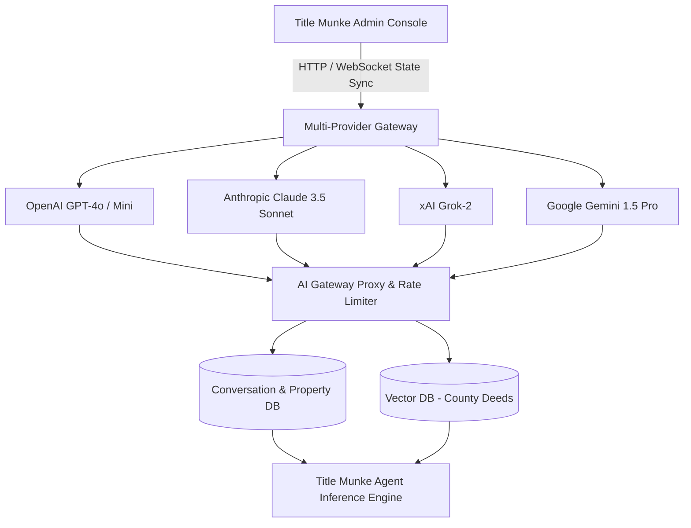

# TITLE MUNKE — AI Settings Architecture

> **The Smarter Way to Search Property Records**  
> AI-powered title searches delivered with speed and accuracy. Helping brokers and agents make confident decisions.

---

## 🏛️ Architectural Overview

Designed by a **Senior SaaS Product Architect**, this frontend architecture decouples state, data providers, and presentational cards to facilitate zero-downtime hot-swapping between mocked local development and production AI Gateway microservices.



---

## 🎨 Brand Identity & Tokens

- **Brand Name**: TITLE MUNKE
- **Primary Color**: `#550000` (Deep Oxblood / Crimson Maroon)
- **Typography**: `Poppins` (`next/font/google` subsets with weights 300–800)
- **Logo Asset**: `public/title-munke-logo.png`
- **Framework**: Next.js 16 (App Router) + TypeScript + Tailwind CSS + Lucide Icons

---

## 📂 Project Structure

```text
src/
├── app/
│   ├── layout.tsx                # Poppins font injection, HTML shell, and global context
│   ├── page.tsx                  # AI Settings page layout and responsive grid
│   └── globals.css               # Design system tokens and scrollbar helpers
├── context/
│   └── AISettingsContext.tsx     # Centralized state store for models, prompts, RAG limits & dirty state
├── data/
│   └── mock-ai-settings.ts       # Title-industry specific mock schemas, providers, and token stats
├── types/
│   └── ai-settings.ts            # Strict TypeScript definitions for providers, pipelines, and quotas
└── components/
    ├── layout/
    │   ├── Sidebar.tsx           # Dark enterprise navigation with Title Munke branding & status
    │   └── Header.tsx            # Title, environment switcher, test triggers, Save Changes (⌘S)
    └── ai-settings/
        ├── ModelConfigurationCard.tsx      # Multi-task model & provider selector
        ├── SystemPromptsCard.tsx           # Side-by-side prompt tuning with variable insertion
        ├── ContextHistorySettingsCard.tsx  # Context window & conversation memory parameters
        ├── TokenUsageOverviewCard.tsx      # Quota gauges, usage trends, and billing projections
        ├── SystemArchitectureDiagram.tsx   # Live interactive topology visualization
        ├── AboutModelSwitchingCard.tsx     # Architectural hot-swap guidelines
        ├── DetailedUsageCard.tsx           # Trigger card for token breakdown
        ├── DetailedUsageModal.tsx          # Enterprise audit drawer with CSV export
        ├── TestConnectionModal.tsx         # Live simulated title deed inference & latency ping
        └── Toast.tsx                       # Real-time state change notifications
```

---

## 🚀 Running Locally

```bash
# Install dependencies
npm install

# Run development server (runs with Turbopack on port 3000)
npm run dev

# Run production build
npm run build
```

---

## ☁️ Deploying to Vercel

### Option 1: Vercel Dashboard (Recommended)
1. Push your repository to **GitHub** / **GitLab** / **Bitbucket**.
2. Go to [vercel.com/new](https://vercel.com/new) and import the repository.
3. Vercel automatically detects Next.js via [`vercel.json`](./vercel.json).
4. In **Environment Variables**, paste the keys from [`.env.example`](./.env.example):
   - `OPENAI_API_KEY`
   - `ANTHROPIC_API_KEY`
   - `GOOGLE_AI_API_KEY`
5. Click **Deploy**.

### Option 2: Vercel CLI
```bash
# Install Vercel CLI globally
npm i -g vercel

# Deploy preview build
vercel

# Deploy to production
vercel --prod
```

---

## 🔌 API & Production Integration Roadmap

1. **Replace Mock State**:
   In `src/context/AISettingsContext.tsx`, swap the initial states in `saveChanges()` and initializers with your API routes (e.g., `/api/v1/ai/settings`, `/api/v1/ai/gateway/ping`).
2. **Dynamic Key Vault**:
   Store OpenAI, Anthropic, Gemini, and Grok credentials securely in AWS Secrets Manager or HashiCorp Vault; the frontend only receives provider IDs and telemetry status.
3. **Audit Trails**:
   Every prompt revision or model switch emits an immutable audit event for Title Insurance compliance.

